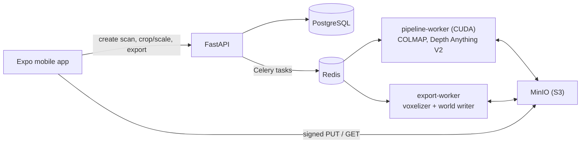

# Video to Minecraft

**Film a room or an object with your phone and get a Minecraft world with it
rebuilt out of blocks.**

You record a short video, walking around a statue or along the walls of your
bedroom. This project works out the 3D shape and colors from that video, turns
them into vanilla Minecraft blocks, and hands you a `world.zip` that you open in
Minecraft Java Edition (26.2) like any other singleplayer world.

```text
  📱 phone video  ──►  🧊 3D point cloud  ──►  🟫 blocks  ──►  🌍 world.zip
     (you record)        (shape + color)       (palette        (open it in
                                                matching)       Minecraft)
```

It runs on your own Linux machine with an NVIDIA GPU. A one-minute room video
takes about 2.5 minutes to process on an RTX 4060 (143 s in the latest
benchmark, `artifacts/bench/RESULTS.md`).

This is a working proof of concept, not a hosted service.

## What you can scan

| | **Object** | **Room / scene** |
|---|---|---|
| Example | a statue, a chair, a car, a building corner | your bedroom, an office, a group of objects |
| How to film | walk in an arc around it | walk along the walls, pointing the camera across the room |
| Video length | up to 1 minute | up to 5 minutes |
| What you get | the object, cropped out with a box you choose | the whole room, closed in by floor, walls and ceiling. The furniture inside is kept, and you can slice the ceiling off to look in |

In both cases you choose how big the build is, for example "100 blocks along the
longest side". A video carries no real-world scale, so the size is up to you.

## Two ways to use it

- **Command line (simplest).** One command takes a video file and writes
  `world.zip`. It needs only Docker and the GPU, with no phone app, database or
  server. See [Quick start: command line](#quick-start-command-line).
- **Phone app (full experience).** Record in the app, watch progress, orbit a 3D
  preview, rotate, crop and resize it with your fingers, then download the world.
  See [Quick start: phone app](#quick-start-phone-app).

## How it works

In short: find where the camera was in every frame, work out how far away
everything was, turn that into colored 3D points, and then snap those points to a
block grid.

1. **Pick good frames.** The video is decoded and the sharpest, best-exposed
   frames that show something new are kept. Blurry and duplicate frames are
   dropped.
2. **Find the camera path.** [COLMAP](https://colmap.github.io/) matches features
   between frames and solves where the camera was and where it pointed for each
   one (*structure from motion*). If too few frames can be placed, the job stops
   early with a clear "please record again" reason instead of producing garbage.
3. **Measure depth.** For every frame, the pipeline estimates how far away each
   pixel is. Two modes are available:
   - **Fast** (default): the [Depth Anything V2](https://depth-anything-v2.github.io/)
     AI model predicts depth for every frame. The predictions are corrected so they
     agree with the camera solve. This takes minutes and gives softer detail.
   - **Detailed:** COLMAP's GPU stereo matching measures depth by comparing
     neighbouring frames. Depth Anything V2 fills only the spots that stereo
     missed, such as blank walls. This takes tens of minutes and gives sharper
     detail.
4. **Build a colored point cloud.** The depth maps become millions of colored 3D
   points. Stray points are filtered out, and the cloud is turned upright with the
   floor made level.
5. **Close the room (room scans only).** Walls and ceilings are often only partly
   seen. The pipeline works out which space is empty (the camera saw through it)
   and builds a closed one-block-thick shell of floor, walls and ceiling around
   it, colored from the nearest real surfaces. Nothing is invented *inside* the
   room: only objects that were actually seen are kept.
6. **Preview and adjust.** You orbit the 3D preview, rotate it in 90° steps, crop
   it, and pick the size in blocks. Before you export, you see an estimate of how
   many blocks that will be.
7. **Turn points into blocks.** Space is divided into block-sized cells. A cell
   becomes a block only if enough reliable points fall in it. Each block's color
   is matched to the closest-looking vanilla block from a curated palette of 38
   plain, full-cube blocks (concrete, wool, terracotta, planks, stone, bricks and
   so on).
8. **Write the world.** The blocks and a stone platform under them are written
   straight into Minecraft's region files, which are then read back to check
   that every block is there. The result is a normal singleplayer world
   (creative mode, cheats on), zipped. A [Paper](https://papermc.io/) Minecraft
   server can do the same job instead (`--world-writer paper`), which takes
   about 13 seconds longer.

Every step reports its status and timing, so the app shows live progress, and a
failed scan says which step failed and why.

<details>
<summary><b>Technical details of each stage</b></summary>

- **Capture and upload.** The app records muted 1080p video, hashes the file,
  and uploads it straight to object storage (S3/MinIO) through a signed,
  create-only URL.
- **Frame selection.** A single FFmpeg pass (NVDEC where possible) decodes 8 FPS
  candidates, which are scored for exposure, sharpness and novelty. Objects keep
  30–240 keyframes, scenes up to 600.
- **Structure from motion.** COLMAP with shared intrinsics. Exhaustive matching
  is used up to 100 frames, and sequential matching with quadratic overlap above
  that. A sparse quality gate checks how many frames registered and the shape of
  the camera path.
- **Detailed mode.** CUDA PatchMatch stereo at 960 px. Monocular depth is fitted
  per frame to the observed depth (robust affine in inverse depth plus a smooth
  local correction) and written only into empty pixels, followed by stereo fusion.
- **Fast mode.** Depth Anything V2 Large depth for every frame, aligned to the
  SfM points and back-projected into a cloud.
- **Canonicalization.** Outlier filtering, a +Y-up rotation and floor snapping.
- **Scene completion.** The per-frame depth maps are fused into a TSDF. Free
  space is carved by multi-view free-versus-occluded voting, and a watertight
  shell is emitted, colored from the nearest observed surfaces.
- **Voxelization.** A cell is kept only if it passes observation-support,
  confidence and known-free checks. Colors are matched in CIE Lab. The output is
  a versioned, deterministic Protobuf + Zstandard file (`voxels.pb.zst`).
- **World generation.** `world_writer.py` writes the Anvil region files of the
  chunks that hold blocks in the layout Paper 26.2 saves (the game generates the
  empty chunks around them and computes the light), copies the level files from
  a captured template, and validates every block by reading the regions back.
  With `--world-writer paper`, a one-shot Paper 26.2 plugin places the blocks, a
  second server start verifies them, and the save is converted to a vanilla
  singleplayer world; both give the same blocks at every position.

The [reconstruction README](services/reconstruction/README.md) explains every
parameter choice with measurements.

</details>

## Tips for a good recording

These are the same tips the app shows before you record:

- **Light it well.** Use even daylight or turn the room lights on. Avoid
  darkness, glare, mirrors, glass, and people or plants moving through the shot.
- **Move, don't spin.** Depth comes from the camera moving sideways. Walk in an
  arc around an object, or along the walls of a room. Turning on the spot gives
  no depth at all.
- **Go slowly and overlap.** Keep about two-thirds of the previous view visible
  as you move. Don't zoom, and avoid sudden turns and motion blur.
- **Cover everything you want.** Anything the camera never sees stays empty.
  Sweep each wall, the floor and every object.
- **Expect trouble with blank surfaces.** Plain white walls and ceilings are the
  hardest part. Include some furniture, edges or texture in most frames.

## Requirements

- Linux with an **NVIDIA GPU**, a recent driver and the
  [NVIDIA Container Toolkit](https://docs.nvidia.com/datacenter/cloud-native/container-toolkit/).
  The images target RTX 40 series cards (CUDA compute capability 8.9) by default;
  see [Building for another GPU](#building-for-another-gpu).
- Docker with Compose v2.
- Optionally, the **Paper 26.2 server JAR** (`paper-26.2-build.112-stable.jar`)
  from [papermc.io](https://papermc.io/downloads/paper), for the Paper world
  writer (`--world-writer paper` or `VTM_WORLDGEN_WRITER=paper`). It is free, but
  it is not included in this repository.
- **Minecraft Java Edition 26.2** to play the result.
- For the phone app only: Node.js, pnpm, and the Android SDK for a development
  build. The app was developed against Android; iOS is configured but untested.

The first image build compiles COLMAP and downloads about 7 GB of PyTorch and model
weights, so expect it to take a while. Later runs reuse the image.

## Quick start: command line

1. Optional, only for `--world-writer paper`: put the Paper JAR where the tools
   expect it (or set `VTM_PAPER_JAR_PATH`):

   ```bash
   mkdir -p infra/paper
   cp ~/Downloads/paper-26.2-build.112-stable.jar infra/paper/
   ```

2. Build the GPU image once:

   ```bash
   docker compose -f infra/compose.yaml build pipeline-worker
   ```

3. Turn a video into a world:

   ```bash
   # A room: closed into a shell, 100 blocks along its longest side
   scripts/video_to_world.sh my-room.mp4 artifacts/cli/my-room --scan-type scene

   # One object, 64 blocks along its longest side
   scripts/video_to_world.sh statue.mp4 artifacts/cli/statue --blocks 64
   ```

4. [Open the world in Minecraft](#opening-the-world-in-minecraft).

The output folder holds `world.zip`, `voxels.pb.zst`, `export.json` (the settings
used and the block count), `logs/`, and `reconstruction/`.

**Re-exporting is fast.** The slow part is the reconstruction, and it is reused
when you run the command again into the same folder with the same video,
`--mode` and `--scan-type`. Trying another size, rotation or crop then takes
about two seconds (1.4-1.8 s for the benchmark object and room). The command
prints the reconstruction bounds after
rotation. Heights and crop boxes are given in those coordinates, which are not
metres, so pick `--top` or a crop box from the printed numbers:

```bash
# Same room, bigger, with the ceiling sliced off (pick Y from the printed bounds)
scripts/video_to_world.sh my-room.mp4 artifacts/cli/my-room --scan-type scene --blocks 160 --top 1.5
```

| Option | Default | Meaning |
|---|---|---|
| `--scan-type object\|scene` | `object` | `scene` closes a room into a watertight shell |
| `--mode fast\|detailed` | `fast` | `detailed` uses stereo matching: sharper, but takes tens of minutes |
| `--blocks N`, `--axis longest\|x\|y\|z` | `100`, `longest` | Size of the build in blocks along one axis |
| `--rotate X Y Z` | `0 0 0` | 90° turns around each axis, like the app's orientation buttons |
| `--top Y` | none | Cut everything above height Y, for example a room's ceiling |
| `--crop-min X Y Z`, `--crop-max X Y Z` | full bounds | Crop box, in coordinates after rotation |
| `--max-blocks N` | `1000000` | Refuse crops that could hold more blocks than this |
| `--world-name NAME` | video file name | Name shown in Minecraft's world list |
| `--force-reconstruct` | off | Reconstruct again even if a matching reconstruction exists |
| `--world-writer direct\|paper` | `direct` | `paper` builds the world with two Paper server runs instead (needs the Paper JAR and Java) |
| `--voxelizer vectorized\|loop` | `vectorized` | `loop` is the original, slower voxelizer; the output is identical |

Run `scripts/video_to_world.sh --help` for the rest. If Docker has several
contexts, use one whose engine has the NVIDIA runtime, for example
`DOCKER_CONTEXT=default`. On a machine with COLMAP, CUDA, FFmpeg, Java and the
reconstruction Python packages installed, you can call
`python3 scripts/video_to_world.py` directly with the same arguments.

## Quick start: phone app

1. Put the Paper JAR in `infra/paper/` as in step 1 above. The workers only
   run it with `VTM_WORLDGEN_WRITER=paper`, but the Compose file mounts that
   path.

2. Install the mobile dependencies, and build the development client onto a
   phone connected over USB or onto an emulator:

   ```bash
   cd apps/mobile && pnpm install && pnpm android && cd ../..
   ```

3. Start everything:

   ```bash
   scripts/start_app.sh
   ```

   This builds and starts the backend (database, queue, storage, API and both
   workers), waits until it is healthy, and then starts the Expo dev server
   pointed at this machine's LAN address. **The phone must be on the same Wi-Fi
   network.** Press Ctrl+C once for a clean shutdown; a running job is allowed to
   finish. Use `--backend-only` to skip Expo, or `--no-build` to reuse the
   existing images.

4. In the app, choose **Object** or **Room / scene**, read the tips, and record.
   Processing keeps running on the server, so you can leave the app and resume
   from the home screen. When the preview is ready, rotate, crop, set the size and
   export. Then download `world.zip`.

To run the backend by hand instead:

```bash
export VTM_S3_PUBLIC_ENDPOINT_URL=http://<your-lan-ip>:9000
docker compose -f infra/compose.yaml up --build
```

The API is then available at `http://localhost:8000`, with interactive docs at `/docs`.

## Opening the world in Minecraft

1. Find your Minecraft `saves` folder. In the launcher, open **Installations**,
   then the folder icon of your installation, then `saves/`. The default
   locations are `~/.minecraft/saves` on Linux and `%APPDATA%\.minecraft\saves`
   on Windows.
2. Make a new folder there, for example `saves/my-room/`, and extract
   `world.zip` into it. `level.dat` must sit directly inside that folder.
3. Start Minecraft Java Edition 26.2 and open the world from **Singleplayer**.
   You spawn on the stone platform in front of the build, in creative mode.

## Troubleshooting

| Problem | What to try |
|---|---|
| Scan fails with `TOO_FEW_REGISTERED_FRAMES` or `TOO_FEW_SHARP_FRAMES` | Record again more slowly, with more sideways movement and overlap, in better light |
| Parts of a room are missing | Those areas were never filmed, or were blank walls or ceiling. Sweep them again with some texture or furniture in view |
| The build is lying on its side | Use the rotate buttons in the app, or `--rotate` on the command line |
| The phone can't reach the server | Put the phone and the computer on the same network, and check that `VTM_S3_PUBLIC_ENDPOINT_URL` uses the computer's LAN IP |
| The export is refused as too large | Pick fewer blocks or a smaller crop. The limits are listed under [Configuration](#configuration) |
| Docker can't find the GPU | Install the NVIDIA Container Toolkit, and use a Docker context with the NVIDIA runtime (`DOCKER_CONTEXT=default`) |

## Architecture



All services run under Docker Compose (`infra/compose.yaml`). Reconstruction and
export run on separate Celery queues, so an export never waits behind a GPU job.

### Repository layout

| Path | Contents |
|---|---|
| `apps/mobile/` | Expo / React Native app: capture, upload, status, 3D preview, crop and scale controls |
| `services/api/` | FastAPI control plane: scan lifecycle, signed URLs, Celery tasks, export preflight, health and metrics |
| `services/reconstruction/` | Reconstruction pipeline (`reconstruct_fixture.py`), depth completion, scene completion, filtering, GLB preview, voxelizer |
| `services/worldgen/` | Python world writer and a Java Paper plugin (opt-in), plus a runner that verifies job manifests, generates, validates and packages the world |
| `packages/contracts/` | Capture JSON schema and the `voxel_world.proto` Python-to-Java handoff (plus a Java reader) |
| `packages/block-palette/` | Curated sRGB colors for the block palette |
| `fixtures/` | Deterministic synthetic capture and point-cloud fixtures, and a real CC BY 4.0 capture |
| `infra/` | Docker Compose stack and Dockerfiles (the CUDA COLMAP image is pinned by commit and digest) |
| `scripts/` | The `video_to_world` CLI, start-up, fixture generation and image build scripts |

Each service has its own README with the details: [API](services/api/README.md),
[reconstruction](services/reconstruction/README.md),
[world generation](services/worldgen/README.md), [mobile](apps/mobile/README.md),
[contracts](packages/contracts/README.md).

## Running the stages separately

The reconstruction pipeline is a standalone CLI. It does not need the API:

```bash
# Build and lock the CUDA/COLMAP image once
scripts/build_reconstruction_image.sh

# Generate the synthetic fixtures and reconstruct one in the container
python3 scripts/generate_capture_fixtures.py
scripts/reconstruct_fixture.sh building-corner-arc

# Or call the entry point directly (needs a host COLMAP + CUDA)
python3 services/reconstruction/reconstruct_fixture.py my-room.mp4 artifacts/reconstructions/my-room \
  --scan-type scene --mode fast
```

The output directory holds `manifest.json`, `canonical.ply`, `preview.ply`, the
COLMAP models and logs. For scene scans, `scene-completion.json` is written too.
Voxelize a result into blocks with:

```bash
python3 services/reconstruction/voxelizer.py canonical.ply voxels.json \
  --crop-min -3 0 -3 --crop-max 3 3 3 --axis x --blocks 60
```

`scripts/fetch_real_capture.py` downloads a 15-second clip of the Tanks and
Temples "Barn" video to use as a real-world test capture.

## API overview

| Method and path | Purpose |
|---|---|
| `POST /v1/scans` | Create a scan (scan type, processing mode) |
| `POST /v1/scans/{id}/upload-url` | Get a signed, create-only upload URL for `video.mp4` / `capture.json` |
| `POST /v1/scans/{id}/upload-complete` | Verify size and SHA-256, then queue reconstruction |
| `GET /v1/scans/{id}` | Scan status: `QUEUED` → `EXTRACTING_FRAMES` → … → `PREVIEW_READY` / `FAILED` |
| `GET /v1/scans/{id}/preview` | Signed URL for the GLB preview and the cloud bounds |
| `PATCH /v1/scans/{id}/reconstruction` | Save the rigid orientation transform and the crop |
| `POST /v1/scans/{id}/exports/estimate` | Voxel size, dimensions and an upper bound on the block count |
| `POST /v1/scans/{id}/exports` | Start an export |
| `GET /v1/exports/{id}` and `/download-url` | Export status and a signed `world.zip` link |
| `GET /health/live`, `GET /health/ready` | Liveness, and readiness of Postgres, Redis and storage |

## Configuration

Configuration uses environment variables with the `VTM_` prefix. See
`services/api/app/config.py`. The most useful ones are:

- `VTM_S3_PUBLIC_ENDPOINT_URL`: storage address that the phone can reach.
- `VTM_WORLDGEN_WRITER`: `direct` (default) writes the world files directly;
  `paper` uses the Paper server.
- `VTM_PAPER_JAR_PATH`: location of the Paper server JAR (for the Paper writer).
- `VTM_WORLDGEN_MANIFEST_KEY`: HMAC key that signs world-generation jobs.
- `VTM_BLOCK_COUNT_WARNING_THRESHOLD` and `VTM_BLOCK_COUNT_HARD_LIMIT`: export
  size limits (defaults 1,000,000 and 5,000,000 blocks; 5,000,000 is the most the
  world generator places).
- `VTM_MAX_VIDEO_BYTES`, `VTM_MAX_CAPTURE_DURATION_MS` and
  `VTM_MAX_SCENE_CAPTURE_DURATION_MS`: upload limits (defaults 2 GiB, 60 s for
  objects and 300 s for rooms).

Local overrides go in `infra/.env`, which is git-ignored.

## Testing

```bash
python3 -m pytest services/api/tests services/reconstruction/tests services/worldgen/tests
pnpm --dir apps/mobile test
pnpm --dir apps/mobile typecheck
mvn -q test
```

The Python environment needs the `test` extras of `services/api` and
`services/reconstruction`. The real-capture GPU reconstruction is opt-in through
`RUN_REAL_CAPTURE_ACCEPTANCE=1`, and running Paper next to the direct world
writer on the same voxels through `RUN_PAPER_EQUIVALENCE=1` (see the
[world generation README](services/worldgen/README.md)).

`services/api/tests/test_pipeline_flow.py` covers the whole worker path, from a
queued scan to a downloadable world ZIP. It uses stand-in reconstruction and
world-generation executables, so it runs without a GPU or a server JAR.

## Building for another GPU

The COLMAP build targets compute capability 8.9 by default. For other cards, set
`RECONSTRUCTION_CUDA_ARCHITECTURES` when building, for example `86` for RTX 30
series cards or `120` for RTX 50 series:

```bash
RECONSTRUCTION_CUDA_ARCHITECTURES=86 scripts/build_reconstruction_image.sh
```

For the Compose stack, change the `CUDA_ARCHITECTURES` build argument in
`infra/containers/reconstruction.Dockerfile`.

## Limitations

- This is a proof of concept. The Compose credentials (`minioadmin`, `vtm`/`vtm`,
  the development manifest key) are for local use only. Don't expose the stack
  to the internet.
- Surfaces with no texture (blank walls, white ceilings) are hard for
  structure from motion. Room scans work around this with relaxed thresholds and
  AI depth, but frames that see only a blank ceiling may still fail to register.
- Detailed mode can take tens of minutes on a consumer GPU. Fast mode is the
  practical choice for room scans.
- Blocks are full cubes picked by color only, so there are no stairs, slabs or
  other shaped blocks, and fine detail is limited by the size you choose.
- Scale comes from you, not from the video: you pick the size in blocks after
  reconstruction.

## Third-party components and data

- [COLMAP](https://github.com/colmap/colmap) (BSD) is built from source inside
  the reconstruction image.
- [Depth Anything V2 Large](https://huggingface.co/depth-anything/Depth-Anything-V2-Large-hf)
  weights are downloaded at image build time. They are licensed **CC BY-NC 4.0**,
  which allows non-commercial use only.
- [Paper](https://papermc.io/) is used for the optional Paper world writer. It is not
  redistributed here.
- The `barn-gable-arc-real` fixture is cut from the
  [Tanks and Temples](https://www.tanksandtemples.org/) "Barn" video (CC BY 4.0;
  Knapitsch et al., 2017).
- The block palette contains color values only, no Minecraft textures or assets.

This project is not affiliated with Mojang or Microsoft. Minecraft is a trademark
of Mojang Synergies AB.
